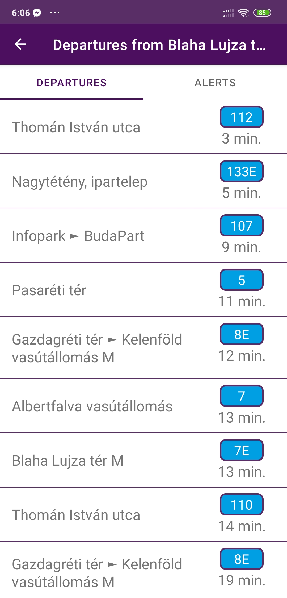

# BKK notifier
2022.10.23

Mobil- és webes szoftverek

Laborvezető: Kapitány Erik

## Bemutatás

Viszonylag gyakran fordul elő velem az, hogy azért késem el valahonnan, mert pont az orrom előtt megy el a buszom, és a következő csak 20 perc múlva jön. Ez az alkalmazás képes értesítéseket küldeni amikor a felhasználónak el kell indulnia a buszmegállóba, hogy még ne késse le a buszát. 

## Főbb funkciók

Az alkalmazás csak a budapesti tömegközlekedéssel működik, a BKK FUTÁR Utazástervező API-jának segítségével tudja lekérdezni a szükséges adatokat.
Az alkalmazásban el lehet menteni a leggyakrabban használt megállóinkat, és meg lehet adni, hogy hány perccel és melyik busz érkezése előtt küldjön értesítést. Az elmentett állomások egy görgethető listában vannak, amihez hozzá tudunk adni új állomásokat, vagy ki tudunk törölni már felvetteket. Ha az alkalmazást bezárjuk, az elmenti az állomásainkat és azok értesítési beállításait és a következő indításkor nem kell újra felvenni azokat. Egy állomás nevére kattintva megjelenik az állomás teljes menetrendje, azaz az összes onnan induló busz indulási ideje. Itt egy külön fülön lehet beállítani az állomáshoz tartozó értesítéseket.

## Választott technológiák:

- UI
- fragmentek
- RecyclerView
- Perzisztens adattárolás
- Hálózati kommunikáció

# Házi feladat dokumentáció

## Funkcionalitás

Az alkalmazás fő képernyőjén a felvett állomásaink láthatóak, amik egy ROOM adatbázisban tárolódnak. A képernyő jobb alsó sarkában levő floating action button megnyomására megjelenik egy dialógus, amivel új állomásokat adhatunk hozzá a listához. Ehhez meg kell adni az állomás nevét is ID-ját. Az ID nélküli hozzáadás, csak név alapján kereséssel, magasan van a TODO listán, valószínűleg a következő patch már tartalmazni fogja. Addig is a legegyszerűbb módja annak hogy megtudjuk egy állomás ID-ját az az, ha odamegyünk a konkrét megállóba, és leolvassuk azt a megálló táblájáról. Általában a megálló neve alatt szokott lenni, BKK_F0xxxx formátumban.

Az állomások nevei mellett van egy switch és egy kuka gomb. A kuka gomb megnyomásával törlődik az állomás a listából és az adatbázisból. A switch bekapcsolására elindul egy service a háttérben, ami indít egy szálat ami 30 másodpercenként lekéri a BKK szerverektől az adott állomáshoz tartozó indulási adatokat. Ezt érdemes kikapcsolni ha nincs beállított alert, vagy nem szeretnénk hogy értesítéseket küldjön az alkalmazás.

Egy állomásra kattintva megjelenik az onnan induló járatok listája(max 50) időrendi sorrendben. Ez a lista szintén 30 másodpercenként frissül ha nem navigálunk el róla.

Egy másik fülön állíthatjuk be az értesítéseket az adott állomáshoz. Itt is egy floating action button megnyomására nyílik meg egy dialógus ablak, ahol meg kell adnunk a járat számát, illetve azt, hogy hány perccel az érkezése előtt kapjunk értesítést. A beállított értesítések szintén elmentődnek az adatbázisba az alkalmazás bezárásakor, és az állomásokhoz hasonlóan egy kuka gombbal törölhetőek.

## Érdekesebb megoldások

Amikor az alkalmazás alapötletét kitaláltam, akkor még nem gondoltam bele hogy külön service-t kell majd írnom az adatok lekéréséhez. Ez jelentősen megnehezítette a komponensek közötti kommunikációt, de lehetővé tette azt, hogy úgy is futni tudjon az alkalmazás, és küldhessen értesítéseket, hogy nincs a képernyőn megnyitva. A serviceben kettő broadcast receiver van regisztrálva, mindkettő a broadcastja hatására elindul egy szál ami az állomás adatait kéri. Azért volt szükség kettőre, mert máshogy kellett kezelnem azt, amikor egy switch bekapcsolására indul el egy adatokat lekérő szál, mint azt amikor megnyitja a felhasználó az állomás indulásainak fülét. A service szintén broadcastokat küld, amit pedig az indulásokat jelző fragment kap el, ha éppen meg van nyitva, és annak hatására frissíti a tartalmát. 

Sok olyan dolgot találtam az elkészítés közben amin még lehetne javítani (és ha lesz időm, fogok is). A servicenek szerintem nem a telefonon kéne futnia, csak a push notificationoket kéne megkapnia. Jelenleg shortpollol a service 30 másodpercenként, és ellenőrzi hogy akkor épp teljesül-e az alert feltétele. Ezt ki lehetne váltani úgy, hogy a service és számolja az időt, és csak néha kérdezné le a szervert, hogy korrigálja magát. Az értesítések rendszere sem a legjobb, ahhoz hogy ne küldjön folyamatosan értesítéseket, csak akkor küld, ha az előző értesítést már bezárta a felhasználó.

# Screenshotok az alkalmazásról

